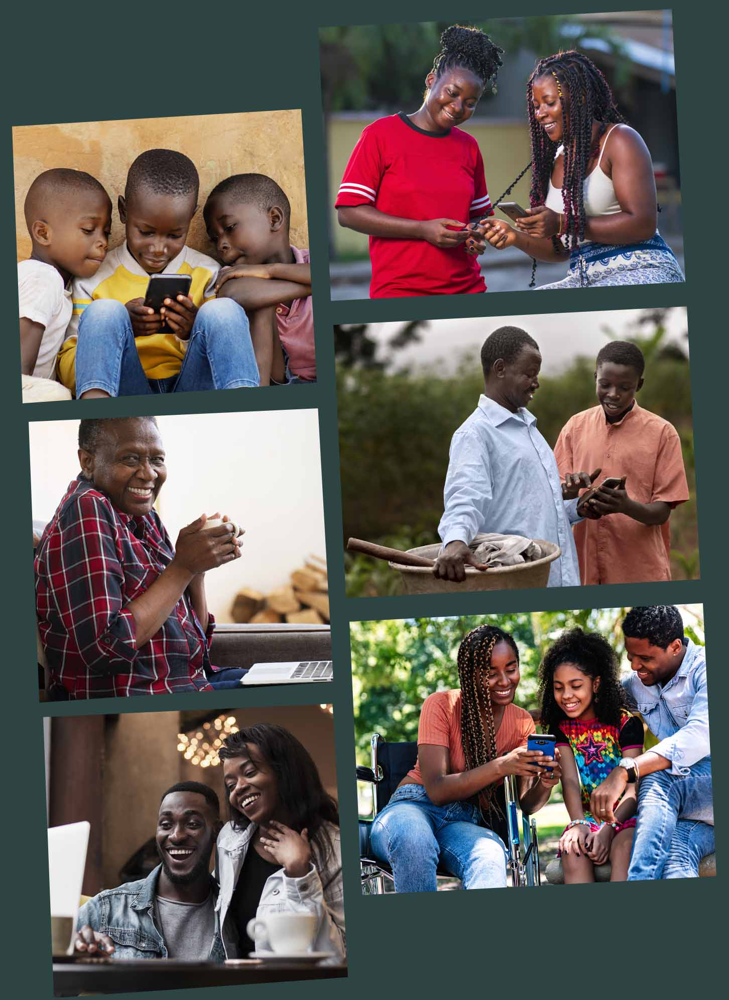
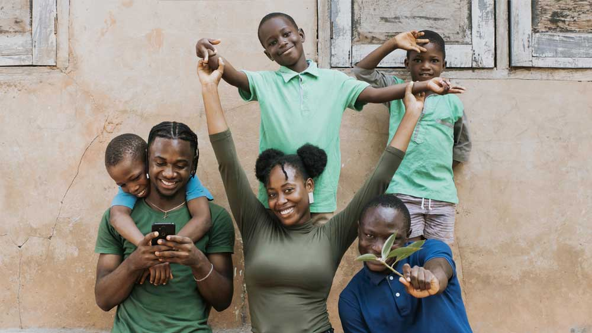
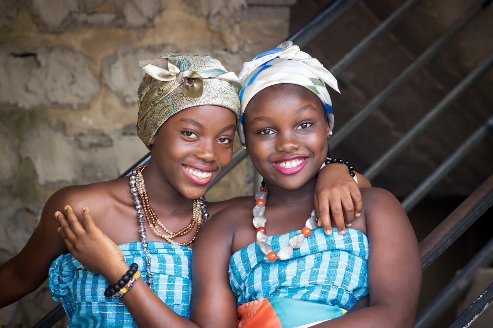



    

        

             <h1 class="text-white lwa-intro-text">
                Nous croyons à la connexion des personnes et en leurs idées.
                Nous les aidons à les développer.
            </h1>
            

               Le Web Africain est une plateforme qui crée des produits numériques ayant pour but d'informer, d'éduquer, de divertir et d'avoir un impact sur le continent.
            

            

                <button type="button" class="btn btn-lwa dropdown-toggle"  type="button" data-bs-toggle="dropdown" aria-expanded="false">
                    Ce que nous avons construit
                </button>
                <ul class="dropdown-menu dropdown-menu-lg-end dropdown-menu-dark">
                    <li><a class="dropdown-item" href="/amarya">Amarya</a></li>
                    <li><a class="dropdown-item" href="/biografrik">Biografrik</a></li>
                    <li><a class="dropdown-item" href="/hame">HERIC</a></li>
                    <li><a class="dropdown-item" href="/molakisi">Molakisi</a></li>
                </ul>
            

        

        

            
        

    

        

            

            <h1 class="fw-bold lwa-text-black">
                    Notre Mission
            </h1>
                

                    <strong>Le Web Africain</strong> est une plateforme qui crée des produits numériques ayant pour but de promouvoir la culture africaine, de créer du contenu africain et aussi de faire participer les africains dans cette création de contenu en leur permettant de partager leurs histoires, leurs cultures et leurs connaissances.
                

                
            

        

    

        

            

                <h1 class="fw-bold text-white mb-5">
                    Nos Valeurs
                </h1>
            

            

                    

      

        

          

            <h4 class="fw-bold mb-0 text-body-emphasis">L'ouverture</h4>
            

                Le Web Africain est ouvert à tous, sans distinction de race, de religion ou de sexe.
            

          

          

            <h4 class="fw-bold mb-0 text-body-emphasis">La diversité</h4>
            

                Le Web Africain est fier de représenter la diversité de la culture africaine.
            

          

          

            <h4 class="fw-bold mb-0 text-body-emphasis">L'inclusivité</h4>
            

                Le Web Africain est un espace où chacun peut se sentir chez soi.
            

          

          

            <h4 class="fw-bold mb-0 text-body-emphasis">La créativité</h4>
            

                Le Web Africain encourage la créativité et l'innovation.
            

          

        

      

            

      
      

    

            

        

    

        

            

                <h1 class="fw-bold lwa-text-black mb-5">
                    Notre Équipe
                </h1>
                

                    Nous sommes un groupe de personnes passionnées, un réseau international aussi enthousiaste que nous le sommes par le mouvement et le progrès de l'afrique.
                

                

                    Nous sommes continuellement à la recherche de personnes brillantes et passionnées pour rejoindre notre équipe. Notre mission ne peut s'accomplir que si les meilleurs esprits travaillent avec nous.
                

                
 
                    Rejoindre <strong>Le Web Africain</strong> vous place à l'avant-garde du changement, au sein d'une entreprise leader dans son secteur, avec une portée et une influence mondiales incroyables.
                

                <a href="https://bit.ly/3woZMpW" class="btn btn-lwa btn-lg mt-5" target="_blank">Réjoignez la communauté</a>
            

        

    

